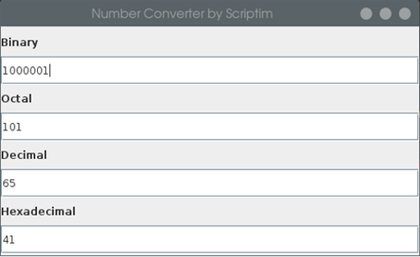

# Number Converter

This application lets you convert numbers in several number systems.

## Compilation
* Unpack Number-Converter.zip
* Navigate to 'Number-Converter'
* Run `javac -g src/Main.java` to compile the source code
* Run `jar cfe Number\ Converter.jar src/Main src/*.class` if you want to build an executable jar file

## Download
Alternatively, you can download the current build on the [release page](https://github.com/Scriptim/Number-Converter/releases "GitHub Realease Page").
